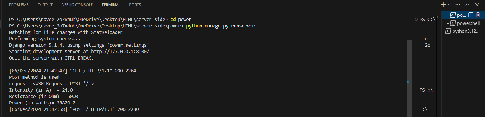
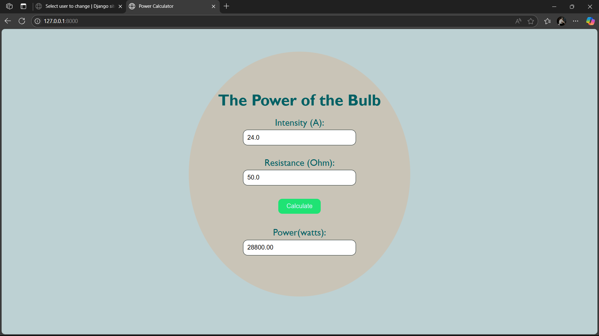

# Ex.05 Design a Website for Server Side Processing
# Date:21-11-2024
# AIM:
To design a website to calculate the power of a lamp filament in an incandescent bulb in the server side.

# FORMULA:
P = I2R
P --> Power (in watts)
 I --> Intensity
 R --> Resistance

# DESIGN STEPS:
## Step 1:
Clone the repository from GitHub.

## Step 2:
Create Django Admin project.

## Step 3:
Create a New App under the Django Admin project.

## Step 4:
Create python programs for views and urls to perform server side processing.

## Step 5:
Create a HTML file to implement form based input and output.

## Step 6:
Publish the website in the given URL.

# PROGRAM :
```
<html>
<head>
    <meta charset="UTF-8">
    <meta name="viewport" content="width=device-width, initial-scale=1.0">
    <title>Power Calculator</title>
    <style type="text/css">
        body {
            background-color: #bdd1d3;
            background-repeat: no-repeat;
            background-position: center;
            background-size: cover;
            text-align: center;
            font-family:'Gill Sans', 'Gill Sans MT', Calibri, 'Trebuchet MS', sans-serif;
            color: #006064;
        }
        h1 {
            font-size: 2.5em;
            margin-bottom: 20px;
        }
        .container {
            background-color: #c9c4b7;
            border-radius: 100%;
            padding: 75px;
            box-shadow:#f71bdd;
            display:inline-block;
            margin-top: 50px;
        }
        label {
            font-size: 150%;
            display:flow-root;
            margin: 15px 0 5px;
            
        }
        input[type="text"] {
            width: calc(75% - 24px);
            padding: 10px;
            border-radius: 12px;
            border: 1px solid #051313;
            margin-bottom: 15px;
            font-size: 1em;
        }
        input[type="submit"] {
            background-color: #1fe374;
            color: rgb(211, 241, 247);
            border: none;
            border-radius: 10px;
            padding: 10px 21px;
            font-size: 1em;
            cursor:pointer;
        }
        button:hover {
            background-color: #d588b2;
        }
        p {
            font-size: 1.2em;
            margin-top: 20px;
        }
    </style>
</head>
<body>
    <div class="container">
        <h1>The Power of the Bulb</h1>
        <form method="POST">
            
        <label >Intensity (A):</label>
        <input type="text" name="intensity" value="{{I}}">
        
        <label >Resistance (Ohm):</label>
        <input type="text" name="resistance" value="{{R}}"><br><br>
        <input type="submit" value="Calculate"><br><br>
        <label>Power(watts):</label>
        <input type="text" name="power" value="{{power}}">
    </div>
</form>        

</body>
</html>

```

# SERVER SIDE PROCESSING:


# HOMEPAGE:

# RESULT:
The program for performing server side processing is completed successfully.
